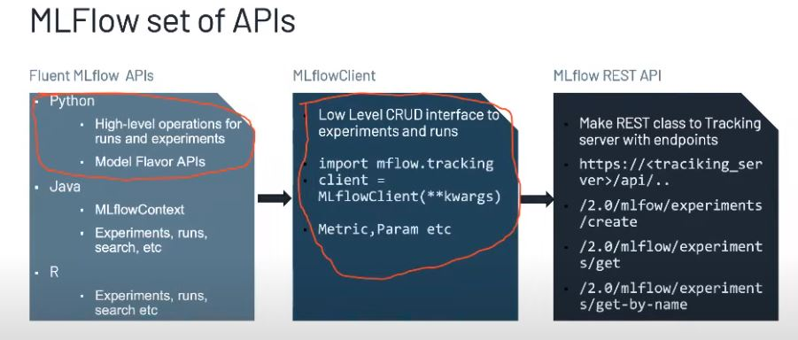

# mlflow-intro
base repo to build an entire ml pipeline using mlflow.

4 key paets in ml flow : 
* [MLflow Tracking](https://mlflow.org/docs/latest/tracking.html) : An API to log parameters, code, and
  results in machine learning experiments and compare them using an interactive UI.
* [MLflow Projects](https://mlflow.org/docs/latest/projects.html) : A code packaging format for reproducible
  runs using Conda and Docker, so you can share your ML code with others.
* [MLflow Models](https://mlflow.org/docs/latest/models.html): A model packaging format and tools that let
  you easily deploy the same model (from any ML library) to batch and real-time scoring on platforms such as
  Docker, Apache Spark, Azure ML and AWS SageMaker.
* [MLflow Model Registry](https://mlflow.org/docs/latest/model-registry.html): A centralized model store, set of APIs, and UI, to collaboratively manage the full lifecycle of MLflow Models.

 

# Defaults
1. local file system to store metadata and artifacts is `mlruns` directory.
2. conda environment, if conda environment is not required, 

# Basic Commands
To know the version of ml flow installed 

    mlflow --version

To start ml flow tracking server in `localhost:5000`. where you can watch metrics, paramenters, metadata, models and artifacts.

Tracking server is stateless, data is stored in the database (local or cloud). 

    mlflow ui

# References

Main Documentaion : https://mlflow.org/docs/latest/index.html

Git Hub : https://github.com/mlflow/mlflow 
